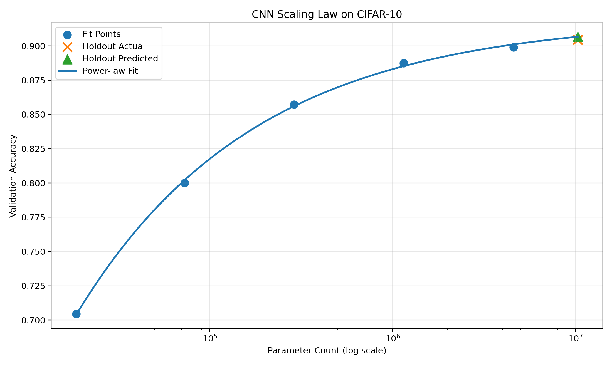

# Bagel Labs Take Home Report

## 0. How to Replicate the Results

All experiments run from a single entry point.

Example run (32-width model, 15 epochs):

```bash
python train.py --width 32 --epochs 15
```

To reproduce the full scaling sweep, run:

```bash
python train.py --width 8 --epochs 15
python train.py --width 16 --epochs 15
python train.py --width 32 --epochs 15
python train.py --width 64 --epochs 15
python train.py --width 128 --epochs 15
python train.py --width 192 --epochs 15
```

Then fit the scaling law and generate the figure:

```bash
python fit_scaling_law.py
```

Results are appended to results/results.csv automatically.

## 1. Question

What empirical scaling law best describes how validation performance improves as CNN parameter count increases on CIFAR-10?

Specifically, I tested whether model error can be approximated by a power law of the form:

E(N) = aN^-b + c

where:

- N = parameter count  
- E = validation error rate  
- a,b,c are fitted constants

---

## 2. Setup

### Model Family

A width-scaled CNN classifier implemented in PyTorch.  
Only channel width was varied so that architecture family remained fixed while parameter count changed.

### Task

CIFAR-10 image classification.

### Hardware

Experiments were run on a consumer laptop GPU (RTX 2060-class hardware).

### Quality Metric

Validation accuracy (reported), with validation error rate used for scaling-law fitting.

### Scale Range

| Width | Parameters |
|------:|-----------:|
| 8 | 18,626 |
| 16 | 72,954 |
| 32 | 288,746 |
| 64 | 1,148,874 |
| 128 | 4,583,306 |
| 192 | 10,303,306 |

This spans over **500×** in model size.

### Training Budget

- 15 epochs per model  
- Same optimizer / training procedure for all runs  
- Same random seed

---

## 3. Prediction

Quoted from `prediction.md` before final experiments:

> Validation error should decrease with parameter count following a diminishing-return power-law trend.  
> Smaller models should gain rapidly from increased capacity, while larger models should saturate due to dataset simplicity, optimization limits, and finite training budget.

---

## 4. Results

Using the first five scales for fitting and holding out the largest model:

E(N) = aN^-b + c

Fitted parameters (Confidence intervals were estimated from nonlinear least-squares covariance).

- a = 17.18 ± 8.468548   (95% CI)
- b = 0.445 ± 0.053286   (95% CI)
- c = 0.0803 ± 0.009882   (95% CI)

Held-out validation:

- Predicted accuracy (10.3M params): **90.67%**  
- Actual accuracy: **90.46%**  
- Absolute prediction error: **0.21%**



*Figure 1. Validation accuracy vs parameter count. Largest model was excluded from fitting and used as a holdout validation point.*

---

## 5. Discussion

### What drives the shape of the law?

I believe the curve has two regimes:

1. **Small-scale regime:** increasing capacity reduces underfitting, producing rapid gains.  
2. **Large-scale regime:** returns diminish because CIFAR-10 is relatively simple, training budget is fixed, and optimization/data limits dominate.

### How far would I trust this law?

Moderate extrapolation (for example 2×–10× larger than observed scale) can be trusted within the same architecture family and training setup. The observed power law was fit in a narrow regime: fixed CIFAR-10 dataset, fixed 15-epoch budget, and a compact CNN family.

However, larger scale is problematic, especially naive extrapolation of this law to 1000× the largest trained scale (~10.3B parameters), where assumptions above are likely to fail.

The weakest assumption is that parameter count remains the dominant scaling variable while data and optimization remain fixed.

What would likely break is not numerical training stability, but compute efficiency: marginal gains would become extremely small while training cost, memory demand, and optimization complexity grow sharply.

In practice, data scarcity and architecture mismatch would likely cause saturation long before the fitted curve remains valid.

### Warning sign

Validation gains from 4.6M to 10.3M are already only +0.55%, that is an empirical warning sign that scaling returns are flattening.

### Compute Efficiency

Training time per epoch remained relatively flat for smaller models, then increased materially at larger scales. For example, with 4.6M params the time is ~29s / epoch, while with 10.3M params the time is ~45s / epoch. However the accuracy has marginal improvement (89.91% -> 90.46%, which is 0.55% improvement). This suggests the cost-efficiency frontier worsens at larger scales in this setup.

### Data-Limited Regime

CIFAR-10 contains only 50k training images and is relatively low-complexity compared with modern large-scale vision datasets. Once model capacity is sufficient to fit the core structure of the task, further parameter growth provides diminishing returns because data, not capacity, becomes the primary bottleneck. A more compute-efficient path at larger scale may be increasing data or training steps rather than parameters alone. This is consistent with the warning sign mentioned above.

### What would break first at 1000× scale?

Most likely:

1. Diminishing returns become extreme  
2. Compute cost rises faster than quality gain  
3. Optimization efficiency changes  
4. Overcapacity relative to CIFAR-10 task complexity

### Practical takeaway

Small-scale experiments were sufficient to accurately forecast larger-scale outcomes in this setting. This suggests scaling-law analysis can be a useful tool for planning expensive training runs before committing large compute budgets.